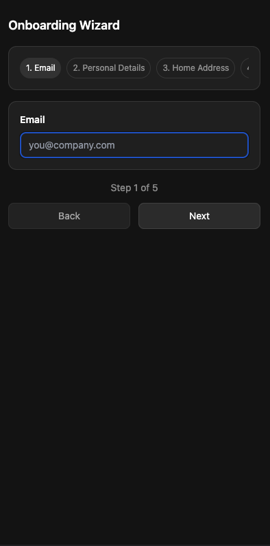
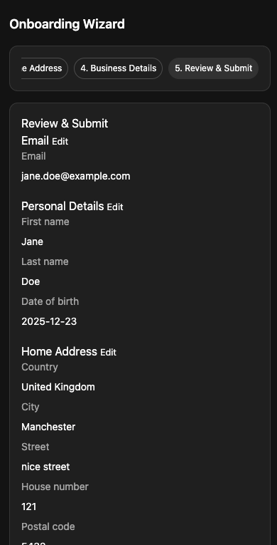
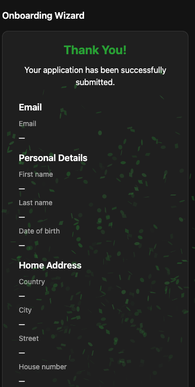
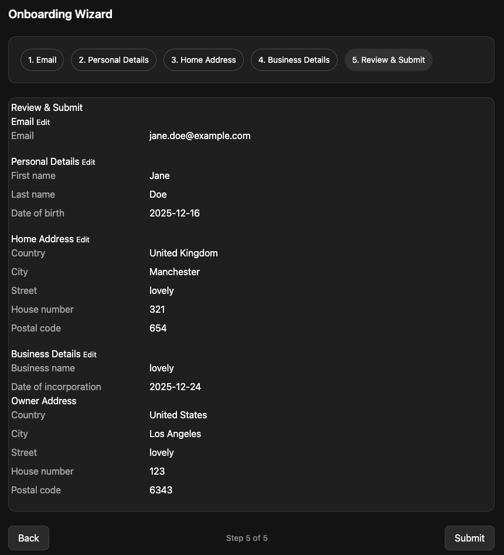
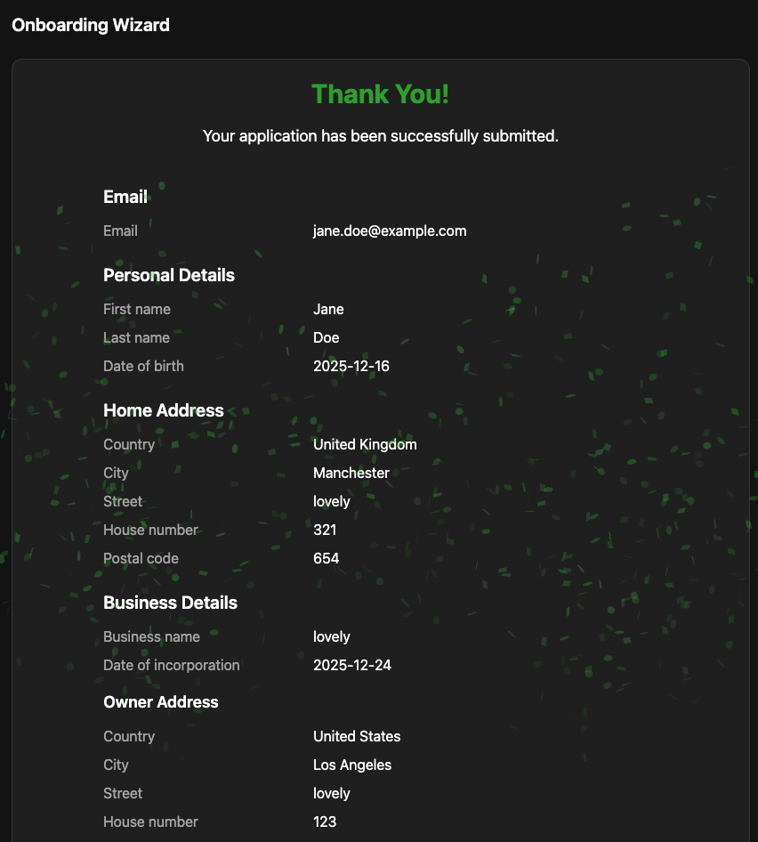

# Onboarding Wizard

A multi-step onboarding wizard application built with React, TypeScript, and Tailwind CSS. This application guides users through a comprehensive onboarding process, collecting email, personal details, home address, and business information with form validation and data persistence.

> **🌐 Live Demo**: [View on GitHub Pages](https://alonzo245.github.io/onboarding-wizard/)

## Screenshots

<table>
<tr>
<td width="50%">
  
  <p><em>Email Step - Initial step with email input and optional pre-filling</em></p>
</td>
<td width="50%">
  
  <p><em>Personal Details Step - First name, last name, and date of birth with calendar picker</em></p>
</td>
</tr>
<tr>
<td width="50%">
  
  <p><em>Home Address Step - Country, city, street, house number, and postal code</em></p>
</td>
<td width="50%">
  
  <p><em>Business Details Step - Business information and owner address</em></p>
</td>
</tr>
<tr>
<td width="50%">
  
  <p><em>Review & Submit Step - Final review of all entered information</em></p>
</td>
<td width="50%">
  <!-- Empty cell for layout -->
</td>
</tr>
</table>

## Features

- **Multi-step Form Wizard**: Step-by-step onboarding process with navigation controls
- **Mobile-First Design**: Built with a mobile-first approach, ensuring optimal user experience on all screen sizes
- **Form Validation**: Real-time validation using Zod schemas with user-friendly error messages
- **Data Persistence**: Automatic saving to `localStorage` to preserve user input across page refreshes
- **Email Pre-filling**: Optional data pre-filling based on email lookup
- **Progress Tracking**: Visual stepper navigation showing current progress and preventing navigation to future steps
- **Accessible Components**: Built with `react-aria-components` for full keyboard navigation and screen reader support
- **Date Picker**: Interactive calendar popup for date selection with internationalization support
- **Responsive Design**: Mobile-first design with Tailwind CSS for optimal experience on all devices
- **Success Celebration**: Confetti animation and thank you page upon successful submission
- **Toast Notifications**: User feedback via `react-toastify` for success and error states

## Tech Stack

- **React 19** - UI library
- **TypeScript** - Type safety
- **React Router DOM** - Client-side routing
- **Vite** - Build tool and dev server
- **Tailwind CSS** - Utility-first CSS framework
- **Zod** - Schema validation
- **React Query** - Data fetching and caching
- **React Aria Components** - Accessible UI components with full keyboard and screen reader support
- **React Toastify** - Toast notifications
- **Canvas Confetti** - Celebration animations
- **clsx** - Conditional class names

## Prerequisites

Before you begin, ensure you have the following installed:

- **Node.js** (v18 or higher recommended)
- **npm** or **yarn** package manager

## Installation

1. **Clone the repository** (if applicable) or navigate to the project directory:

2. **Install dependencies**:

   Using npm:

   ```bash
   npm install
   ```

   Or using yarn:

   ```bash
   yarn install
   ```

## Running Locally

### Development Server

Start the development server:

Using npm:

```bash
npm run dev
```

Or using yarn:

```bash
yarn dev
```

The application will be available at `http://localhost:5173` (or the port shown in the terminal).

### GitHub Pages Deployment

The project is configured for automatic deployment to GitHub Pages via GitHub Actions.

**Setup Instructions:**

1. **Enable GitHub Pages** in your repository settings:

   - Go to your repository on GitHub
   - Navigate to Settings → Pages
   - Under "Source", select "GitHub Actions"

2. **The deployment workflow** (`.github/workflows/deploy.yml`) will automatically:

   - Build the project on every push to `main` branch
   - Deploy to GitHub Pages
   - The app will be available at: `https://alonzo245.github.io/onboarding-wizard/`

3. **Base Path Configuration:**

   - The `BASE_URL` is set to `/onboarding-wizard/` in the workflow, which matches your repository name
   - This ensures all assets (CSS, JS) are correctly referenced with the proper base path
   - The base path is automatically configured in `vite.config.ts` to use the `BASE_URL` environment variable
   - The router is configured to handle the base path correctly

4. **Manual Deployment:**
   - Go to Actions tab in GitHub
   - Select "Deploy to GitHub Pages" workflow
   - Click "Run workflow"

**Note:** After enabling GitHub Pages, the first deployment may take a few minutes. Subsequent deployments happen automatically on each push to `main`.

### Build for Production

To create a production build:

Using npm:

```bash
npm run build
```

Or using yarn:

```bash
yarn build
```

The built files will be in the `dist` directory.

### Preview Production Build

To preview the production build locally:

Using npm:

```bash
npm run preview
```

Or using yarn:

```bash
yarn preview
```

## Project Structure

```
onboarding-wizard/
├── src/
│   ├── components/
│   │   └── onboarding-wizard/
│   │       ├── OnboardingWizard.tsx    # Main wizard container component
│   │       ├── OnboardingContext.tsx   # Global state management
│   │       ├── Header.tsx               # Stepper navigation component
│   │       ├── Footer.tsx               # Navigation footer component
│   │       ├── common/
│   │       │   └── DatePicker.tsx       # Reusable date picker component
│   │       ├── schema/
│   │       │   └── validation.ts       # Zod validation schemas
│   │       ├── steps/
│   │       │   ├── Email.tsx           # Email input step
│   │       │   ├── PersonalDetails.tsx  # Personal information step
│   │       │   ├── HomeAddress.tsx      # Home address step
│   │       │   ├── BusinessDetails.tsx # Business information step
│   │       │   ├── ReviewSubmit.tsx     # Review and submit step
│   │       │   └── ThankYou.tsx        # Success page
│   │       └── types.ts                # TypeScript type definitions
│   ├── mocks/
│   │   ├── api.ts                      # Mock API functions
│   │   ├── countries.json              # Country data
│   │   └── me.json                     # Sample user data
│   ├── router.tsx                      # React Router configuration
│   ├── main.tsx                        # Application entry point
│   └── index.css                       # Global styles and Tailwind directives
├── index.html                          # HTML template
├── package.json                        # Dependencies and scripts
├── tailwind.config.ts                  # Tailwind CSS configuration
├── tsconfig.json                       # TypeScript configuration
└── vite.config.ts                      # Vite configuration
```

## Wizard Steps

1. **Email** - Enter email address with optional pre-filling
2. **Personal Details** - First name, last name, and date of birth (with calendar picker)
3. **Home Address** - Country, city, street, house number, and postal code (with accessible select components)
4. **Business Details** - Business name, incorporation date (with calendar picker), and owner address
5. **Review & Submit** - Review all entered information before submission
6. **Thank You** - Success page with submitted data and celebration animation

## Key Features Explained

### Form Validation

- Each step has its own validation schema using Zod
- Errors are displayed only after user interaction (on blur or when clicking "Next")
- Validation prevents navigation to the next step until all required fields are valid

### Data Persistence

- All form data is automatically saved to `localStorage` as the user types
- Data persists across page refreshes
- Submitted data is stored separately and cleared after viewing the thank you page

### Progress Control

- Users can only navigate to steps they've already completed
- The `furthestStep` state tracks the highest step reached
- Navigation links to future steps are disabled until reached

### Responsive Design

- **Mobile-First Approach**: The entire wizard is designed mobile-first, ensuring the best experience on small screens while gracefully scaling up to larger devices
- Horizontal scrolling stepper on mobile devices
- Active step automatically centers in the mobile stepper view
- Full-width buttons on mobile for better touch targets
- Side-by-side button layout on mobile for easier navigation
- Optimized spacing and typography that adapts to screen size

## Development Notes

- The application uses mock API functions located in `src/mocks/api.ts`
- Country data is loaded from a static JSON file
- Form state is managed through React Context API
- TypeScript strict mode is enabled for better type safety
- Date inputs use `react-aria-components` DatePicker with popup calendar for better UX
- Select components use `react-aria-components` for accessibility and consistent styling
- All form components are built with accessibility in mind, supporting keyboard navigation and screen readers

## Browser Support

The application supports all modern browsers that support ES6+ features, including:

- Chrome (latest)
- Firefox (latest)
- Safari (latest)
- Edge (latest)

## License

This project is private and proprietary.
